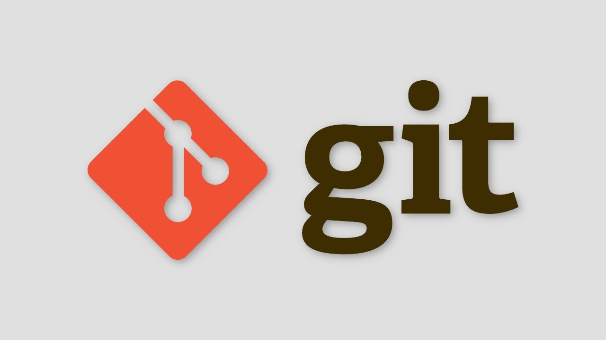

# *Инструкция Git и удалёнными репозиториями* 

***Что такое Git?***
Git - это одна из реализаций распределённых систем контроля версий, имеющая как и локальные, так и удалённые репозитории. Является самой популярной реализацией систем контроля версий в мире.
## ***Подготовка репозитория***

Для создание репозитория необходимо выполнить команду *git init*  в папке с репозиторием и у Вас создаться репозиторий (появится скрытая папка .git)

 ## ***Создание коммитов***

 **Git add**
 
 Для добавления измений в коммит используется команда *git add*. Чтобы использовать команду *git add* напишите *git add <имя файла>*

### **Просмотр состояния репозитория git status**
Для того, чтобы посмотреть состояние репозитория используется команда *git status*. Для этого необходимо в папке с репозиторием написать *git status*, и Вы увидите были ли измения в файлах, или их не было.

### **Создание коммитов git commit**
Для того, чтобы создать коммит(сохранение) необходимо выполнить команду *git commit*. Выполняется она так: *git commit -m "<сообщение к коммиту>*. Все файлы для коммита должны быть ***ДОБАВЛЕНЫ*** и сообщение к коммиту писать ***ОБЯЗАТЕЛЬНО***.

## **Перемещение между сохранениями git checkout**
Для того, чтобы перемещаться между коммитами, используется команда *git checkout*. Используется она в папке с пепозиторием следующим образом: *git checkout <номер коммита>*

## **Журнал изменений git log**
Для того, чтобы посмтреть все сделанные изменения в репозитории, используется команда *git log*. Для этого достаточно выполнить команду *git log* в папке с репозиторием

## **Ветки в Git**

### **Создание ветки git branch**

Для того, чтобы создать ветку, используется команда *git branch*. Делается это следующим образом в папке с репозиторием: *git branch <название новой ветки>*

## **Слияние веток git merge**

Для того чтобы дабавить ветку в текущую ветку используется команда *git merge <name branch>*

## **Удаление веток git branch -d **
Для удаления ветки ввести команду "git branch -d 'name branch'"

## Работа с удаленным репозиторием 
**git clone**  — создание копии (удаленного) репозитория
Для начала работы с центральным репозиторием, следует создать копию оригинального проекта со всей его историей локально.
Клонирует репозиторий, используя собственный протокол:

  git clone git://user@somehost:port/~user/repository/project.git
   
   ## git pull — забираем изменения из центрального репозитория
   Для синхронизации текущей ветки с репозиторием используются команду git pull. Команда git pull сразу забирает изменения и проводит слияние с активной веткой. Забирает из репозитория, для которого были созданы удаленные ветки по умолчанию. 
   
   
## git push — вносим изменения в удаленный репозиторий 

После проведения работы в экспериментальной ветке, слияния с основной, необходимо обновить удаленный репозиторий (удаленную ветку). Для этого используется команда git push.

Отправляет свои изменения в удаленную ветку, созданную при клонировании по умолчанию:
